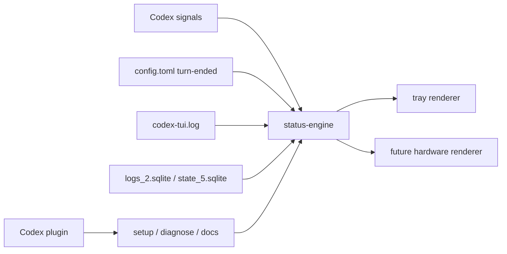

# Tauri Cross-Platform Plan

## Why this form

A pure Codex plugin is a good control surface, but it is not the best place to host a permanently visible runtime light.

The most suitable final product shape is:

1. a `Tauri 2` tray application
2. a shared status engine that reads Codex runtime signals
3. a Codex plugin that helps with install, diagnosis, and future operator workflows

That gives us:

- `macOS`: menu bar light
- `Windows`: system tray light
- one shared status core
- one place to add future hardware or webhook renderers

## System design

## Module split

### `packages/status-engine`

- resolves local Codex paths for `macOS` and `Windows`
- parses log lines into semantic events
- keeps the red/yellow/green state machine consistent
- exposes a stable contract for any renderer

### `apps/status-light-shell`

- owns tray UI and platform packaging
- subscribes to the status engine output
- shows current color, last reason, last event time, and quick actions

### `plugins/codex-status-light`

- documents how the light works inside Codex
- becomes the future place for `status`, `diagnose`, `start`, and `stop` workflows
- keeps the Codex-side setup local to the repo

## Runtime status model

- `green`: Codex is idle or has just completed a turn
- `yellow`: Codex is actively working, streaming, or running a tool call
- `red`: Codex errored, was interrupted, or appears stuck past the stale timeout

## Phased rollout

### Phase 1

- finish the shared status engine
- validate signal rules against real local logs
- add a simple JSON snapshot writer for renderer consumption

### Phase 2

- create the Tauri tray shell
- wire `macOS` menu bar and `Windows` tray menu
- show current color and a short reason string

### Phase 3

- add settings UI
- add optional startup-at-login
- add optional plugin-assisted diagnosis and reset flows

## Acceptance criteria

- the same signal rules produce the same color on both platforms
- tray state changes within one signal update cycle
- idle, working, error, interrupt, and timeout are visually distinct
- Codex plugin docs are enough for a teammate to reinstall and extend the system

